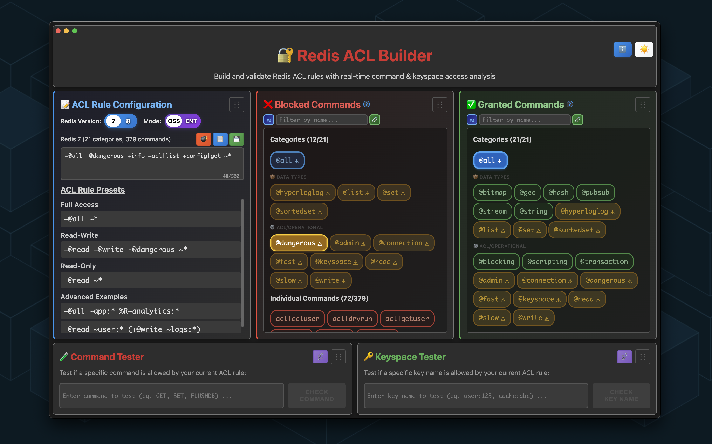

# Redis ACL Builder

A high-performance application for testing and validating Redis Access Control
List (ACL) rules with real-time command analysis and interactive visual
feedback.


> **Note:** Available as both a native desktop application and web/Docker
deployment. Desktop apps feature auto-updates, offline support, and native
performance without requiring Python installation.

📖 **[Visit the Wiki](https://github.com/markotrapani/redis-acl-builder/wiki)**
for comprehensive guides, tutorials, and documentation.



---

## 🚀 Quick Start

> 📖 **New to Redis ACL Builder?** Check out the [Getting Started
> Guide](https://github.com/markotrapani/redis-acl-builder/wiki/Getting-Started)
> in the wiki for a complete walkthrough.

### Option 1: Desktop App (Recommended for End Users)

📦 **[Download Latest
Release](https://github.com/markotrapani/redis-acl-builder/releases/latest)** -
Signed and notarized installers

**Features:** No Python required • Auto-updates • Offline support • Native
performance

> 📖 **Detailed installation instructions:** See the
> [Installation Guide](https://github.com/markotrapani/redis-acl-builder/wiki/Installation)
> in the wiki.

<!-- markdownlint-disable MD033 -->
<details>
<summary><b>📱 Installation Instructions (Click to expand)</b></summary>

**macOS:**

```bash
# Download the .dmg for your architecture
# - Redis-ACL-Builder-1.0.0-arm64.dmg (Apple Silicon - M1/M2/M3)
# - Redis-ACL-Builder-1.0.0-x64.dmg (Intel Macs)

# Install:
# 1. Open the DMG file
# 2. Drag "Redis ACL Builder" to Applications folder
# 3. Launch from Applications (app is signed and notarized - no security warnings!)
```

**Windows:**

```bash
# Download Redis-ACL-Builder-Setup-1.0.0.exe
# Run the installer and follow the prompts
# App will be available in Start Menu
```

**Linux:**

```bash
# Download Redis-ACL-Builder-1.0.0.AppImage
chmod +x Redis-ACL-Builder-1.0.0.AppImage
./Redis-ACL-Builder-1.0.0.AppImage

# Or install the .deb package (Debian/Ubuntu)
sudo dpkg -i Redis-ACL-Builder_1.0.0_amd64.deb
```

</details>
<!-- markdownlint-enable MD033 -->

### Option 2: Docker (Fastest for Servers/Web)

🐳 **[Docker Hub
Repository](https://hub.docker.com/r/markotrapani608/redis-acl-builder)** -
Latest builds with automated CI/CD

```bash
# Run the latest version directly from Docker Hub
docker run -d --name redis-acl-builder -p 7380:7380 --restart unless-stopped markotrapani608/redis-acl-builder:latest

# Access the application
open http://localhost:7380
```

<!-- markdownlint-disable MD033 -->
<details>
<summary><b>🔄 Upgrade Instructions (Click to expand)</b></summary>

```bash
# Simple one-liner (stops, removes, and recreates with latest image)
Ready to test your Redis ACL rules? Download the desktop app or
try it in your browser!

# Or use docker-compose (recommended)
docker compose pull && docker compose up -d
```

</details>
<!-- markdownlint-enable MD033 -->

### Option 3: Local Development Installation

**For developers:** Python 3.7+ required

<!-- markdownlint-disable MD033 -->
<details>
<summary><b>💻 Development Setup (Click to expand)</b></summary>

1. **Download/Clone the project:**

   ```bash
   git clone https://github.com/markotrapani/redis-acl-builder.git
   cd redis-acl-builder
   ```

2. **Create virtual environment:**

   ```bash
   python -m venv venv
   source venv/bin/activate  # On Windows: venv\Scripts\activate
   ```

3. **Install dependencies:**

   ```bash
   pip install -r backend/requirements.txt
   ```

4. **Run the application:**

   ```bash
   # Option 1: Use helper script
   ./scripts/run-web.sh

   # Option 2: Run directly
   python backend/app.py
   ```

5. **Open your browser:**
   Navigate to `http://localhost:7380`

</details>

## Overview

Redis ACL Builder is a powerful tool that helps developers and system
administrators understand and test Redis ACL configurations before deploying
them to production.

> ⚠️ **Important:** This tool is designed based on **Redis OSS** (Open Source)
command sets, which are also compatible with **Redis Stack**. Redis Enterprise
may restrict certain OSS commands (cluster management, replication, dangerous
operations) for security reasons. If a command test fails in Redis Enterprise,
this is expected behavior - the command exists in OSS but is restricted in
Enterprise. See [Redis Enterprise vs
OSS](https://redis.io/docs/management/enterprise/) for details.

**Core Capabilities:**

- ✅ Parse and validate Redis ACL rule syntax with real-time feedback
- ✅ Test commands and keyspace patterns with dual testing interface
- ✅ Visualize granted/blocked commands organized by categories
- ✅ Support for Redis 7 (311 commands) and Redis 8 (446 commands including
  modules)
- ✅ Light/Dark mode theme system with localStorage persistence
- ✅ Available as web app (Docker/local) and native desktop app (macOS, Windows,
Linux)

## Usage Guide

> 📖 **Complete Usage Guide:** For detailed usage instructions, examples, and
> best practices, see the
> [User Guide](https://github.com/markotrapani/redis-acl-builder/wiki/User-Guide)
> in the wiki.
>
> ⚠️ **Important:** This tool is designed for testing and validating ACL rules
> in development/staging environments. Always test thoroughly before applying
> ACL rules to production Redis instances.

### Basic Usage

1. **Select Redis Version**: Choose between Redis 7 or Redis 8 using the radio
   buttons
2. **Enter ACL Rule**: Type your ACL rule in the text area (left column)
3. **Interactive Management**:
   - Click granted commands (center column) to revoke them
   - Click blocked commands (right column) to grant them
   - Use Submit Changes button when manually editing rules
   - **Keyboard Shortcuts**:
     - Press **Enter** to submit pending changes
4. **View Results**: See granted and blocked commands organized by categories
   and individual commands
5. **Test Commands**: Use the command tester at the top to check specific
   commands
6. **Search & Filter**: Use the search bars at the top of each column to filter
   categories and commands

> 💡 **Tip:** Use the dual testing interface at the top to test both commands and
key patterns simultaneously. Results show exactly which permissions are granted
or denied.

<details>
<summary><b>📝 ACL Rule Syntax (Click to expand)</b></summary>

> 📖 **Full syntax reference:** See the
> [User Guide](https://github.com/markotrapani/redis-acl-builder/wiki/User-Guide)
> for comprehensive ACL syntax documentation.

The application supports standard Redis ACL syntax:

#### Command and Category Rules

- `+@read` - Grant all read commands
- `-@write` - Deny all write commands  
- `+@all` - Grant all commands
- `+get` - Grant specific GET command
- `-flushdb` - Deny specific FLUSHDB command

#### Key Pattern Rules

- `~user:*` - Allow access to keys matching pattern
- `~cache:*` - Allow access to cache keys

#### Rule Examples

**Read-only access:**

```acl
+@read ~data:*
```

**Application user with restrictions:**

```acl
+@read +@write -@dangerous -@admin ~app:* ~session:*
```

**Developer access:**

```acl
+@all -flushdb -flushall -shutdown
```

**Monitoring user:**

```acl
+@read +info +ping +client
```

**Analytics user:**

```acl
+@read +@bitmap +@hyperloglog -@admin
```

</details>

### Command Testing

Use the **Command Tester** section to:

1. Enter a Redis command (e.g., `GET`, `SET`, `HGETALL`)
2. Click "Test Command"
3. See if the command is allowed and why
4. View which categories the command belongs to

## Production Deployment

### Basic Deployment

```bash
# Set production environment
export FLASK_ENV=production
export FLASK_DEBUG=False

# Run with Gunicorn
pip install gunicorn
gunicorn --bind 0.0.0.0:7380 --workers 4 app:app
```

### Docker Deployment (Recommended)

See **Quick Start** section above for Docker deployment options.

**Additional deployment configurations:**

```bash
# Specific version
docker run -d --name redis-acl-builder -p 7380:7380 --restart unless-stopped markotrapani608/redis-acl-builder:1.0.0

# Custom port mapping
docker run -d --name redis-acl-builder -p 8080:7380 --restart unless-stopped markotrapani608/redis-acl-builder:latest
```

<details>
<summary><b>🔌 API Endpoints (Click to expand)</b></summary>

> 📖 **Complete API documentation:** See the
> [API Reference](https://github.com/markotrapani/redis-acl-builder/wiki/API-Reference)
> for detailed endpoint documentation, request/response schemas, and examples.

The application provides a RESTful API for programmatic access:

### Core Endpoints

- `POST /api/parse` - Parse ACL rule and return granted commands
- `POST /api/test-command` - Test if a specific command is allowed
- `POST /api/validate-rule` - Validate ACL rule syntax
- `POST /api/command-info` - Get information about a command
- `GET /api/categories` - Get all available categories
- `POST /api/search-commands` - Search commands with patterns
- `GET /health` - Application health check

### Example API Usage

```bash
# Parse an ACL rule
curl -X POST http://localhost:7380/api/parse \
  -H "Content-Type: application/json" \
  -d '{"rule": "+@read -@dangerous", "version": "redis7"}'

# Test a command
curl -X POST http://localhost:7380/api/test-command \
  -H "Content-Type: application/json" \
  -d '{"rule": "+@read", "command": "GET", "version": "redis7"}'

# Validate rule syntax
curl -X POST http://localhost:7380/api/validate-rule \
  -H "Content-Type: application/json" \
  -d '{"rule": "+@read +get", "version": "redis7"}'
```

</details>

<details>
<summary><b>💻 Development (Click to expand)</b></summary>

> 📖 **Developer documentation:** See the
> [Development Guide](https://github.com/markotrapani/redis-acl-builder/wiki/Development)
> for detailed setup instructions, architecture overview, and contribution
> guidelines.

## Development

### Setting Up Development Environment

1. **Fork/Clone the repository**
2. **Create virtual environment:**

   ```bash
   python -m venv venv
   source venv/bin/activate
   ```

3. **Install dependencies:**

   ```bash
   pip install -r backend/requirements.txt
   npm install  # For E2E testing
   ```

4. **Run the application:**

   ```bash
   # Option 1: Use helper script
   ./scripts/run-web.sh

   # Option 2: Run directly
   python backend/app.py
   ```

5. **Run tests:**

   ```bash
   # Backend tests
   pytest tests/backend/ -v

   # E2E tests
   npx playwright test --config=tests/playwright.config.js
   ```

### Code Organization (Monorepo Structure)

- **Backend**: `backend/` - Python Flask app, helpers, models
- **Frontend**: `frontend/` - Static assets (CSS/JS) and templates
- **Scripts**: `scripts/` - Helper scripts (run-web.sh, build-web.sh)
- **Tests**: `tests/backend/` (pytest) and `tests/e2e/` (Playwright)
- **Electron**: `electron/` - Desktop app wrapper (see
  [docs/ROADMAP.md](docs/ROADMAP.md))

</details>

<details>
<summary><b>🧪 Testing (Click to expand)</b></summary>

> 📖 **Testing guidelines:** See the
> [Development Guide](https://github.com/markotrapani/redis-acl-builder/wiki/Development#testing)
> for detailed testing documentation and contribution workflow.

## Testing

The project includes a comprehensive test suite with 223 tests covering all
functionality.

### Test Coverage Summary

- **Overall Coverage**: 85%
- **Core Logic** (helpers/): 95-100%
- **API Endpoints**: 78%
- **All tests passing**: ✓

### Running Tests

#### Method 1: Backend Tests (Recommended)

```bash
# Run all backend tests
pytest tests/backend/ -v

# With coverage
pytest tests/backend/ --cov=backend --cov-report=html
```

#### Method 2: E2E Tests

```bash
# Run Playwright E2E tests
npx playwright test --config=tests/playwright.config.js

# Run in UI mode
npx playwright test --ui --config=tests/playwright.config.js
```

### Test Categories

- **Unit Tests**: Core functionality validation
  - Data loading and indexing
  - ACL rule parsing accuracy
  - Permission evaluation logic
  - Search and validation features

- **API Tests**: All endpoint validation
  - Request/response handling
  - Error cases and status codes
  - Version switching
  - Input validation

- **Integration Tests**: End-to-end scenarios
  - Complete workflow testing
  - Complex ACL rule patterns
  - Real-world use cases

</details>

<details>
<summary><b>🚀 CI/CD & Build System (Click to expand)</b></summary>

## CI/CD & Build System

**All automated builds are now managed in the redis-acl-builder repository.**

### GitHub Actions Workflows

**Repository**:
[github.com/markotrapani/redis-acl-builder/actions](https://github.com/markotrapani/redis-acl-builder/actions)

#### 🐳 Docker Builds (Web Application)

- **Workflow**: `.github/workflows/docker-publish.yml`
- **Triggers**: Version tags (`v*.*.*`, `v*.*.*-alpha`, `v*.*.*-beta`)
- **Platforms**: linux/amd64, linux/arm64 (multi-arch)
- **Outputs**: Docker images published to [Docker
  Hub](https://hub.docker.com/r/markotrapani608/redis-acl-builder)
- **Features**: Automated CVE scanning with Docker Scout

#### 💻 Desktop Builds (Electron App)

- **Workflow**: `.github/workflows/build-desktop.yml`
- **Triggers**: Version tags (`v*.*.*`, `v*.*.*-desktop*`) + manual dispatch
- **Platforms**: Windows (x64), macOS (ARM64 + Intel x64), Linux (x64)
- **Outputs**:
  - Windows: NSIS installer + ZIP
  - macOS: DMG + ZIP (separate ARM64 and Intel builds)
  - Linux: AppImage + .deb package
- **Features**: PyInstaller backend bundling, platform-specific installers

### Migration Notice (October 2025)

> **Important**: CI/CD workflows were migrated from the parent `marko-projects`
repository to `redis-acl-builder` on 2025-10-15.
>
> - **Old builds** (pre-October 2025): Available at
[github.com/markotrapani/marko-projects/actions](https://github.com/markotrapani/marko-projects/actions)
(historical reference only)
> - **New builds** (October 2025+): All builds now run in
[github.com/markotrapani/redis-acl-builder/actions](https://github.com/markotrapani/redis-acl-builder/actions)
>
> This consolidation provides better organization, with each submodule owning
its own build pipelines.

### Version Tag Strategy

**Fast macOS ARM64 build** (debugging/testing - ~2 minutes):

```bash
git tag v2.1.8-test && git push origin v2.1.8-test
git tag v2.1.8-debug && git push origin v2.1.8-debug
```

**Full multi-platform build** (production - ~5 minutes):

```bash
git tag v2.1.8-beta && git push origin v2.1.8-beta   # macOS, Windows, Linux + Docker
git tag v2.1.8-alpha && git push origin v2.1.8-alpha
git tag v2.1.8 && git push origin v2.1.8
```

**Docker build only** (web app):

```bash
git tag v2.1.8-docker && git push origin v2.1.8-docker
```

**Documentation updates only**:

```bash
git tag v2.1.8-docs && git push origin v2.1.8-docs
```

</details>

<details>
<summary><b>📁 Project Structure (Click to expand)</b></summary>

## Project Structure

```txt
redis-acl-builder/
├── backend/                    # Flask application
│   ├── app.py                 # Main Flask app
│   ├── helpers/               # Core logic modules
│   │   ├── data_loader.py    # Redis command database
│   │   └── acl_parser.py     # ACL parsing engine
│   ├── models/                # Data models
│   └── requirements.txt       # Python dependencies
├── frontend/                   # Web interface
│   ├── static/
│   │   ├── css/              # Modular CSS (6 files)
│   │   └── js/               # Modular ES6 JS (13 files)
│   └── templates/
│       └── index.html        # Main interface
├── electron/                   # Desktop app wrapper
│   ├── main.js               # Electron main process
│   ├── preload.js            # Preload script
│   └── package.json          # Electron config
├── scripts/                    # Helper scripts
│   ├── run-web.sh            # Start web app
│   └── build-web.sh          # Build script
├── tests/                      # Test suites
│   ├── backend/              # Backend tests (pytest)
│   └── e2e/                  # E2E tests (Playwright)
└── docs/                       # Documentation
    └── ROADMAP.md           # Product roadmap (includes desktop app details)
```

</details>

## 🏗️ Architecture

The application features modern, modular frontend and backend architectures with
a **monorepo structure**:

- **Monorepo**: Organized into `backend/`, `frontend/`, `electron/`, `scripts/`,
and `tests/` directories - single source of truth for both web app and Electron
desktop app
- **Frontend**: Modular ES6 JavaScript (13 modules) + Optimized Modular CSS (6
  modules) with professional desktop-like resize experience
- **Backend**: Flask with comprehensive Redis ACL parsing and API layer
- **Database**: Hardcoded Redis command databases based on **Redis OSS** (open
  source)
  - **Redis 7 OSS**: 379 commands across 21 categories (admin, cluster,
  replication, latency, module management, etc.)
  - **Redis 8 OSS**: 446 commands across 29 categories (includes RediSearch,
  JSON, TimeSeries, Bloom, and other module commands)
  - **Note**: Redis Enterprise blocks certain commands (cluster management,
  replication, dangerous operations) for security. If a command test fails in
  Redis Enterprise, this is expected behavior - the command exists in OSS but is
  restricted in Enterprise.
- **Testing**: 65 automated E2E tests (Playwright) with 100% pass rate
- **Type Safety**: Professional type annotations with 94% reduction in Pylance
  strict errors (comprehensive typing across all modules)
- **UI/UX**: Elegant resizable container system with real-time content
synchronization, drag-drop panel reordering, and perfect responsive design

## ✨ What's New

### v1.0.0 - First Stable Release 🎉

- **🚀 Production Ready**: First non-beta release after extensive testing
  - 65/65 E2E tests passing (100%)
  - 227+ backend tests passing
  - Comprehensive manual testing completed
- **🏢 Enterprise/OSS Mode Toggle**: Toggle between Redis deployment types
  - Purple gradient for OSS mode, gold gradient for Enterprise mode
  - Dynamic command counts: Redis 7 (379 OSS / 305 ENT), Redis 8 (488 OSS / 440 ENT)
- **🖥️ Multi-Platform Desktop Apps**: Signed, notarized, auto-updating
  - macOS (ARM64 + Intel) - Signed and notarized
  - Windows (x64) - NSIS installer
  - Linux (x64) - AppImage
- **🐳 Docker Deployment**: Multi-arch images on Docker Hub
- **📖 Comprehensive Documentation**: Wiki, API reference, user guides

### v2.9.1-beta

- **🐛 Bug Fix**: URL parameter synchronization
  - Fixed URL not updating when switching between Redis 7 and Redis 8
  - URL now correctly reflects selected Redis version (e.g., `?version=redis8`)
  - Ensures URL state stays in sync with application state

### v2.9.0-beta

- **🏢 Enterprise/OSS Mode Toggle**: New mode selector for Redis deployment types
  - Toggle between OSS (all commands) and Enterprise (cloud-restricted) modes
  - Purple gradient for OSS mode, gold gradient for Enterprise mode
  - Shows "Redis E. X" prefix when in Enterprise mode
  - Command counts update in real-time: Redis 7 (379 OSS / 305 ENT),
    Redis 8 (488 OSS / 440 ENT)
- **✨ UI Enhancements**: Polished toggle interface
  - Matches Redis Version toggle styling for consistency
  - Proper layout with toggles side-by-side and version info below
  - Text colors adapt to background (black on white pill, white on colored background)
  - No text wrapping with `white-space: nowrap` on version detail
- **🔧 Mode Switching Logic**: Seamless mode transitions
  - Preserves ACL rules when switching modes
  - Re-parses rules with new command set automatically
  - localStorage persistence and URL parameter support
  - Updates Interactive ACL Builder lists in real-time
- **✅ Test Coverage**: 100% passing (42/42 E2E tests)
  - 14 new tests specifically for Enterprise/OSS mode toggle
  - All core functionality tests updated and passing

### v2.7.0-beta

- **📦 Category Organization**: Improved category panel structure and clarity
  - Separated categories into "Data Types" and "ACL/Operational" sections
  - Section headers clearly indicate category type for better navigation
  - Maintains priority ordering within each section (explicit → implicit, full →
    partial)
- **🔍 Category Search Refinement**: Enhanced search experience
  - Category section headers automatically hide during active searches
  - Matched categories display prominently without visual clutter
  - Perfect restoration of original layout when search is cleared
  - DOM cloning ensures button positions remain stable
- **📊 Accurate Category Counts**: Fixed category count display logic
  - Count headers now accurately reflect all visible categories
  - Includes both fully and partially granted/blocked categories in totals
  - Eliminates confusing discrepancies between count and visible buttons
- **🎨 Button Layout Optimization**: Improved category button wrapping
  - Better space utilization with `flex: 0 1 auto` and `min-width: fit-content`
  - Reduced awkward gaps and orphaned buttons
  - Natural wrapping behavior that respects content width
- **🔧 Tooltip Positioning**: Smart tooltip expansion behavior
  - Tooltips stay near trigger button when expanding (instead of always jumping
    to top)
  - Falls back to viewport top only when necessary to prevent overflow
  - Improved user experience when exploring command details

<details>
<summary><strong>View Previous v2.x Releases</strong></summary>

### v2.3.4-beta

- **🎨 UI/UX Improvements** (from v2.3.2-beta): Version badge and update button
  repositioning
  - Moved version badge from bottom-left to top-left corner for better
    visibility
  - Positioned "Check for Updates" button to right of version badge with optimal
    spacing
  - Fine-tuned heights and padding for visual consistency
- **📦 Update Modal Cleanup** (from v2.3.2-beta): Simplified Docker upgrade
  experience
  - Removed redundant "Alternative: Pull and restart manually" section
  - Added browser refresh instruction for Docker users after upgrade
  - Reduced minified JS by 31.7% (5.71 KB → 3.90 KB)
- **📚 Documentation Consolidation**: Complete version synchronization
  - Updated all version references across README.md, CLAUDE.md, ROADMAP.md
  - Added comprehensive v2.3.2-beta and v2.3.4-beta accomplishment tracking
  - Ensures complete documentation parity between Docker and Desktop platforms

### v2.3.2-beta

- **🎨 UI/UX Improvements**: Version badge and update button repositioning
  - Moved version badge from bottom-left to top-left corner for better
    visibility
  - Positioned "Check for Updates" button to right of version badge with optimal
    spacing
  - Fine-tuned heights and padding for visual consistency
- **📦 Update Modal Cleanup**: Simplified Docker upgrade experience
  - Removed redundant "Alternative: Pull and restart manually" section
  - Added browser refresh instruction for Docker users after upgrade
  - Reduced minified JS by 31.7% (5.71 KB → 3.90 KB)

### v2.3.1-beta

- **✅ Auto-Update UX Refinement**: Improved update notification behavior
  - Fixed annoying "You have the latest version!" dialog that appeared on EVERY
    app startup
  - Silent background checks at startup (only shows dialog if update IS
    available)
  - Manual "Check for Updates..." always shows dialog for all outcomes
  - Matches standard desktop app auto-update UX patterns (Slack, VS Code, etc.)

### v2.3.0-beta

- **🔐 macOS Notarization**: Professional Apple code signing with App Store
  Connect API
  - Signed and notarized installers - no security warnings on macOS
  - Full trust chain validation for macOS Gatekeeper
- **✅ Auto-Update System**: Complete implementation with update detection and
  download
  - Automatic update checks on app launch
  - Manual update checks via application menu
  - User-friendly download and install dialogs with progress tracking
- **🚀 Production-Ready**: All platform builds working with auto-update
  infrastructure
  - macOS (ARM64 + Intel): Signed, notarized DMG installers
  - Windows: NSIS installers
  - Linux: AppImage + .deb packages
- **📦 Artifact Management**: Automated cleanup workflow to manage storage costs
  - Weekly cleanup of old build artifacts
  - Preserves last 3 releases for auto-update functionality
  - Reduces GitHub Actions storage costs by ~70%

### v2.1.9-beta - Debug Builds, Build Optimization & Release Cleanup

- **🐛 Debug Build Configuration**: Detached DevTools for debugging without UI
  disruption
  - `-debug` tags open DevTools in separate window (doesn't crush main app)
  - Marker-based detection (`.debug-build` file created during builds)
  - Perfect for debugging and testing without obstructing the interface
- **⚡ Build Performance**: 20-30% faster builds with aggressive caching
  - Python pip dependency caching
  - PyInstaller build artifact caching
  - Reduced multi-platform build time from ~5m17s to ~4min
- **🧹 Automated Release Cleanup**: Auto-delete source code archives
  - GitHub's auto-generated source archives removed automatically
  - Cleaner release pages without manual intervention
- **📦 Reduced Release Bloat**: ~40% fewer files per release
  - macOS: DMG only (removed ZIP)
  - Windows: NSIS installer only (removed ZIP)
  - Linux: AppImage only (removed .deb)
  - Streamlined releases with only essential installers
- **🏷️ Enhanced Tag Strategy**: Clear separation of build types
  - `-test`: Local builds only (npm run build:mac) - no workflows
  - `-test-release`: ARM64 + GitHub release for auto-update testing
  - `-debug`: ARM64 with detached DevTools
  - `-desktop`: Multi-platform desktop-only (no Docker rebuild)
  - `-beta/-alpha`: Full production releases (Docker + all platforms)
- **🎨 UI Enhancements**: Version indicator and consistent panel borders
  - Version indicator in bottom-left corner (e.g., "v2.1.9-beta")
  - Consistent light gray borders across all panels
  - Better visual hierarchy and polish

### v2.1.7-beta - Auto-Update Infrastructure & Fast Build Workflow

- **🔄 Auto-Update System**: Complete auto-update infrastructure with
  electron-updater
  - ✅ Automatic update detection on app launch
  - ✅ Manual update check via application menu
  - ✅ User-friendly download/install dialogs with progress tracking
  - ✅ GitHub releases integration for update distribution
  - ⚠️ Note: Installation requires code signing (Apple Developer account)
- **⚡ Fast Build Workflow**: Dedicated macOS ARM64-only workflow for debugging
  - 2-minute builds vs 5-minute multi-platform builds
  - Auto-publishes to GitHub releases on `-test`/`-debug` tags
  - Perfect for rapid iteration and testing
- **🏷️ Smart Tag Strategy**: Tag suffixes control which builds run
  - `-test`, `-debug`: Fast macOS ARM64 only
  - `-beta`, `-alpha`: Full multi-platform + Docker
  - `-docker`: Docker only
  - `-docs`: No builds
- **📦 Multi-Platform Ready**: macOS (ARM64 + Intel), Windows (NSIS + ZIP), Linux
(AppImage + .deb)
- **🔐 Code Signing Infrastructure**: Ready for Apple Developer setup
  - Entitlements and notarization scripts prepared
  - Auto-updates will work automatically once code signing enabled

### v2.0.3-alpha - Enhanced Category Tooltips

- **🎨 Intelligent Command Highlighting**: Category tooltips display relevant
  commands with color-coded bold text
- **🔧 Parameter Passing Fix**: Resolved function wrapper issues preventing
  bold/color styling
- **✅ Bug Fix**: Tooltip expansion correctly displays full command list

### v2.0.0-alpha - Electron Desktop App & UI Polish

- **🖥️ Native Desktop App**: macOS desktop app with Electron + PyInstaller
  backend bundling
- **🔧 Command Sort Order**: Fixed sorting to prioritize explicit commands before
  implicit
- **💾 Rule Preservation**: Rules preserved on page refresh
- **📊 Search Enhancements**: Fuzzy relevance scoring and improved UI feedback

</details>

---

<details>
<summary><strong>View Full Version History</strong></summary>

### v1.25.1-beta - Optimization Box Persistence & Backend Error Fix

- **🐛 Critical Backend Fix**: Fixed undefined `warnings` variable error in
  `optimize_rule(michael.tchistopolskii@redis.com)` method
- **📌 Optimization Persistence**: Optimization suggestions now remain visible
  while typing

### v1.25.0-beta - Backend Category Analysis

- **🧠 Backend Category Intelligence**: Complete category analysis engine
classifies categories as fully granted, partially granted (with percentages), or
blocked based on actual command permissions
- **📊 API Enhancement**: `/api/parse` endpoint now returns comprehensive
category analysis including `granted_categories`, `partial_categories` (with
grant counts and percentages), and `blocked_categories`
- **✅ Test Suite Explosion**: Expanded from 127 → 195 passing tests (+68 new
tests, 0 skipped)
  - 12 comprehensive API-level category analysis tests
  - 19 button interaction tests validating UI logic
  - 16 @all category behavior tests
  - 8 ACL precedence validation tests
- **🧹 Code Cleanup**: Removed 16 obsolete skipped tests (-319 lines) with proper
  documentation
- **🔧 Test Fixes**: Fixed all test signature mismatches and API response
  structure assertions
- **📈 Coverage Improvement**: Test coverage increased from 82% → 85% (API
  coverage: 71% → 78%)

### v1.21.3-beta - Version Prefix Standardization

- **📐 Consistent Versioning**: Standardized version prefix usage across all
  documentation
- **🏷️ Git Tags**: All git tags use `v` prefix (v1.21.3-beta)
- **🐳 Docker Tags**: All Docker image tags use no prefix (1.21.3-beta)
- **📚 Documentation**: Clear separation between git and Docker version
  references
- **🧹 Cleanup**: Removed inconsistent `1.16.0-beta` tag, replaced with
`v1.16.0-beta`

### v1.21.2-beta - Testing Section Flash Fix

- **✨ Zero Flash Rendering**: Eliminated visual flash when testing panels are in
  custom order
- **🎯 CSS Order Properties**: Uses flexbox `order` property set by inline script
  for instant correct rendering
- **🚀 Performance**: Testing sections now render in correct order from the first
  frame
- **🔧 Smart Detection**: Only applies ordering when panels differ from default
  position

### v1.21.1-beta - Docker Build Performance Optimization

- **⚡ 42% Faster Builds**: Multi-arch Docker builds reduced from 2m 40s to ~1m
  30s
- **📦 Split Dependencies**: Separated production (`requirements-prod.txt`) and
  test (`requirements-test.txt`) dependencies
- **🚀 ARM64 Optimization**: Eliminated coverage compilation (100 seconds saved
  on ARM64 builds)
- **🔄 Coverage Upgrade**: Updated to 7.6.9 with pre-built ARM64 wheels
- **🐳 Smaller Production Image**: Docker image excludes test dependencies for
  faster deployments
- **🛠️ Dev Workflow Unchanged**: Local development still uses `pip install -r
  requirements.txt`

### v1.21.0-beta - Testing Section Drag-and-Drop Feature

- **🎨 Complete Drag-and-Drop System**: Full drag-and-drop reordering for testing
  sections
- **⋮⋮ Grabbable Handles**: Visual drag handles matching three-column panel
  design
- **✨ Smooth Animations**: Professional animations with flash prevention and
  localStorage persistence
- **🎯 Perfect UX**: Universal pointer-events approach disables all hover effects
  during drag

### v1.20.5-beta - Critical Docker Bugfix

- **🐛 CRITICAL FIX**: Added missing `models/` directory to Docker image
  (ModuleNotFoundError resolved)
- **✅ Production Ready**: Docker image now fully functional with all required
  Python modules
- **⚠️ Note**: Docker images v1.20.0 through v1.20.3 were non-functional and
  removed from Docker Hub

### v1.20.0-beta - Rule Selectors & Advanced Key Permissions

- **Rule Selectors**: Complete frontend & backend support
  - Full UI integration for selector syntax with proper command display
  - Real-time validation with "Selector #1:" error prefixes
  - Enhanced testing showing which selector granted access
  - Perfect selector isolation with informative error messages
  - OR logic implementation

- **Advanced Key Permissions**: Bug fixes & improvements
  - Full keyspace access fix (no key patterns = access to all keys)
  - Better error messages for permission type mismatches
  - Smart isolation hints only when relevant
  - Proper handling of read-write commands like GETSET

### v1.15.10-beta - Documentation Synchronization & Docker Hub Integration

- **📋 Documentation Workflow**: Comprehensive synchronization process preventing
  version drift across releases
- **🐳 Docker Hub Prominence**: Direct repository link and quick-start deployment
  prominently featured
- **⚙️ Mandatory Process**: Systematic version update workflow ensuring
  documentation accuracy

### v1.15.8-beta - Professional Type Safety

- **🔍 Pylance Compliance**: 94% reduction in strict type checking errors across
  all modules
- **📝 Comprehensive Annotations**: Full type annotations for Flask routes,
helper functions, and data structures
- **🎯 Python 3.13 Support**: Updated to latest Python version with enhanced type
  safety features
- **✅ Zero Breaking Changes**: Maintained 100% test coverage throughout type
  safety implementation

### v1.15.7-beta - Production CI/CD Pipeline

- **🚀 Automated Docker Hub**: Multi-architecture builds (AMD64/ARM64) with
  automated publishing
- **🔒 Security Scanning**: Docker Scout CVE analysis with vulnerability
  management
- **🏷️ Smart Tagging**: Automatic version tagging with :latest, :beta, and
semver tags
- **⚡ Optimized Builds**: Docker layer caching reducing build times from 15+ to
  5-10 minutes

</details>

## Acknowledgments

Special thanks to **Michael Tchistopolskii**
(<michael.tchistopolskii@redis.com>) for substantial improvement ideas and
architectural guidance that helped shape the development of this application.

## License

This project is provided as-is for educational and development purposes.

## Support

For questions, feedback, or issues:

1. **FAQ**: Check the
   [Frequently Asked Questions](https://github.com/markotrapani/redis-acl-builder/wiki/FAQ)
   wiki page
2. **Troubleshooting**: See the
   [Troubleshooting Guide](https://github.com/markotrapani/redis-acl-builder/wiki/Troubleshooting)
   for common issues and solutions
3. **Contact**: [Marko Trapani](https://github.com/markotrapani) - Project
   Developer
4. **Technical Issues**: Run `python test_imports.py` for diagnostics
5. **Test Verification**: Check results with `./tests/run_tests.sh`
6. **Docker Deployment**: See [Docker Hub
   Repository](https://hub.docker.com/r/markotrapani608/redis-acl-builder)
7. **Setup Issues**: Ensure all files are in the correct locations per
   installation guide

---
